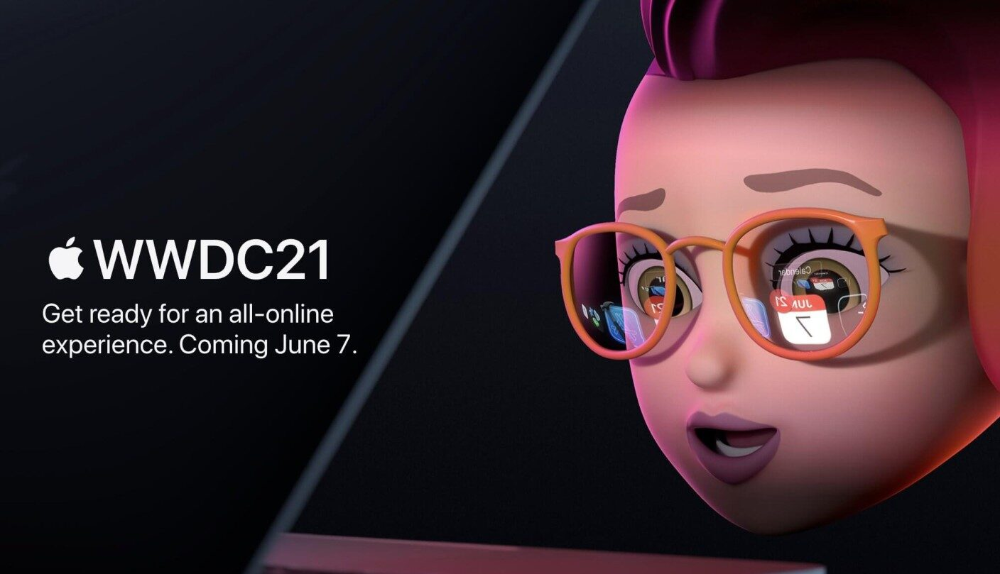
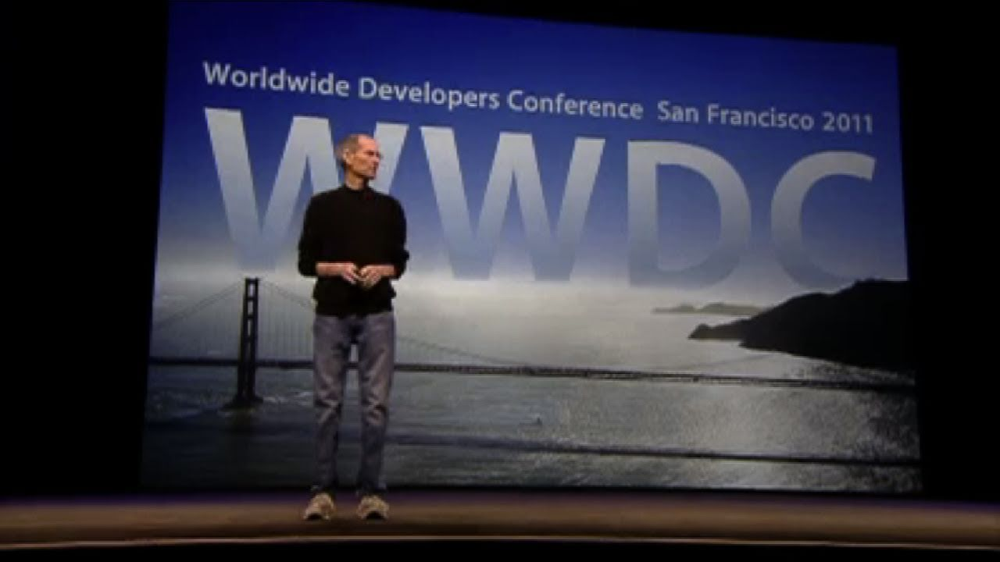
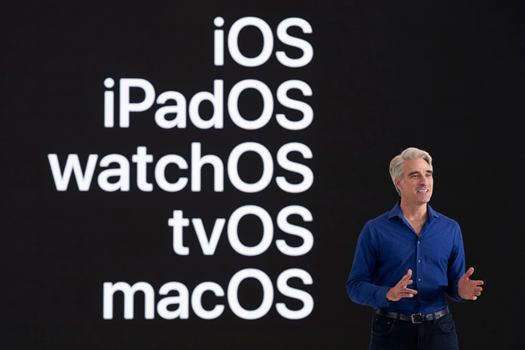
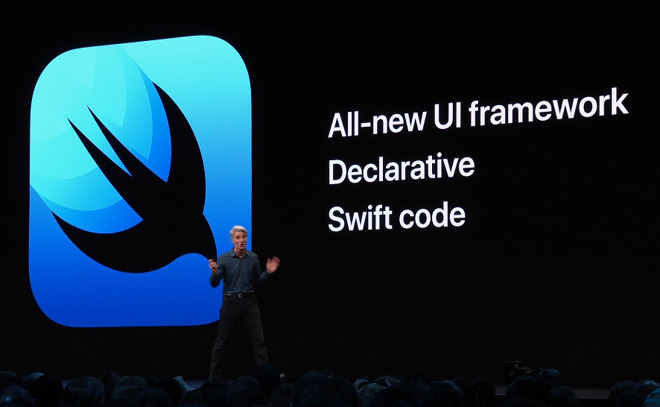

As far as I can remember, I started watching WWDC since 2011, when iOS 5 was introduced. That was the last Apple Event which was hosted by Steve Jobs, the founder of Apple, who was my spiritual mentor when I was in high school. Also that year, I owned my first ever Apple device, the second generation of iPad, which was also the last Apple product that introduced by Jobs in the spring of that year.

I didn’t really know what WWDC stands for back then. Only I knew that it was an event hosted by Apple every year in June to release the new major update of Apple’s platforms’ systems. It’s all about software. As an ordinary user of Apple products, I was excited to watch the events live, even if it would be 1 am in my time zone. My focus then, was on the new systems’ features that could improve my experience on the daily usage basis of my Apple devices, which simply being enough attractive to me. But I wasn’t quite aware that, WWDC is mainly held for Apple software developers, which is short for World Wide Developers Conference (No wonder that each start of the WWDC events could have an announcement that Apple had paid how much money to the developers totally).

Not until 2014, when the Swift programming language was first introduced, I started to realize that the WWDC is held for developers. As I was writing on this, I paused to review the announcement video of Swift on YouTube. I could still feel about the tremendous excitement of the audience as well as the presenters, which reminded me that it was the first time that occurred to me one day I should become an iOS developer.

However, I chose to learn Web development since that year. Maybe I thought that Web development was much easier to learn (JavaScript could be much easy to learn than Objective-C, to be specific, I thought), in addition that there were technologies which could be used for building apps by using Web technology. Building apps in native languages remained one of my dreams since then.

Even though I chose the path of Web development, I still kept watching WWDC events every June. I have witnessed the launch of OS X Yosemite, which was the version when I first encountered macOS, which had the all new designed user interfaces compared to previous version of macOS. I still remember the joke made by the presenter, Craig Federighi, the vice president of software engineering of Apple, when introducing how was that version of OS X named. And that made me a fan of Craig, who was becoming the star of WWDC events in my thoughts.

When I bought the redesigned iPad Pro in late 2018, and still found few things could do on it, I was thrilled to witness the introduction of iPadOS on the next years’ WWDC event. The experience of multitasking on iPad was dramatically improved. And the new name for iOS on iPad indicated that they really started to care about the operating system for iPads, differed from the original iOS for iPhones. I was fascinated, imaging becoming productive on my iPad Pro. Even though there is still a huge gap between an iPad and a Mac on what they are capable of, I can see the progress is being made. After the most powerful chip made by Apple, M1, was brought to the iPad in the spring of this year, no fans of iPad can resist to wonder how the iPadOS will evolve to take advantage of the beast M1 chip in this June.

Also in the June of 2019, SwiftUI was announced, the key technology made me finally decide to launch the Xcode on my MacBook to write some iOS interfaces in SwiftUI. As a Web developer writing React code for years, it was straightforward to me to pick up writing SwiftUI, for they sharing such a common declarative idea on writing user interfaces.

I dabbled with SwiftUI for a while in the late 2019. I bought courses on design+code website. Followed a bunch of great and successful iOS developers on Twitter. Some of them are independent developers, some come from famous tech companies or startups. And they all keep inspiring me with their love and passions on technologies. I was dreaming about becoming a member of them. Chances hadn’t come to me to invest my majority of time in iOS development until last October.

Neither an inspiring talk from some famous people nor a deliberated plan made by myself that finally made me decide to the path of iOS development, but a casual chat with a friend after the dinner. Why not, why not put your energy into your dreamed work while you still can?

As planned, I launched my first ever iOS app, Vision, in the App Store successfully, gained several 5-star comments from users all over the world. Now, I have almost finished my second major update for the app, planning to release in the end of this month, while looking forward to the next WWDC event in two days, which I will attend not as a user, but a developer for the first time!
