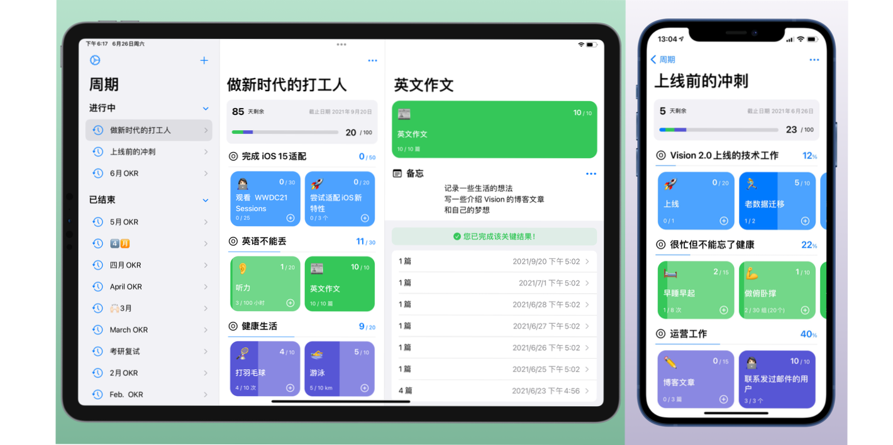
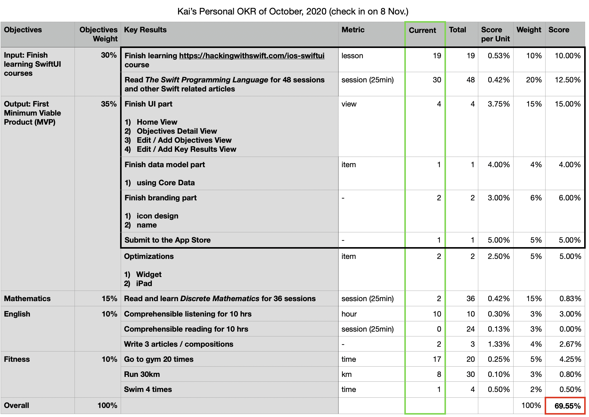
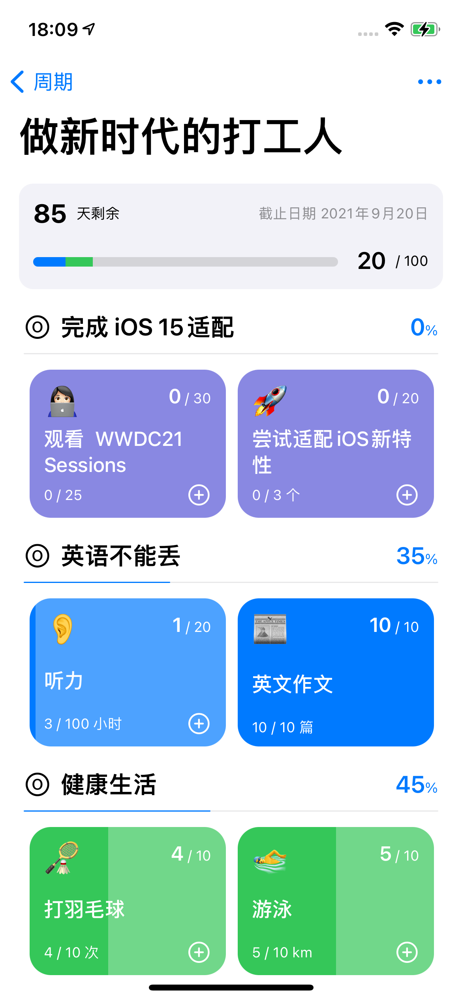

[本文在少数派的链接]: https://sspai.com/post/67497

[本文在少数派的链接]

## 为什么要做 Vision

作为一名果粉和 Web 开发者，每年 6 月份我都会观看 WWDC，几乎每次看完都有种想要转型 iOS 开发的冲动，但奈何一直不能下定决心走出自己的舒适圈去追逐梦想。去年，我所在公司引入了 OKR 的目标管理法。虽然我没有亲身参与，但从侧面也对 OKR 做了很多了解。一天，我又开始纠结自己的职业发展道路时，突然想起 OKR，并想知道它对个人的目标管理是否有作用。于是，我按照制定 OKR 的流程，对我自己想要实现的事逐一仔细思考，认为学习 iOS 开发，并开始尝试 Apple 平台的独立开发，是一个既能实现我的梦想，又有机会发展成副业赚钱的方向。

在认真确认好自己的大方向的时候，我坐下来，仔细思考我需要先实现哪些“小目标”：

- 阅读和学习 Swift 及 SwiftUI 的相关文档和课程
- 完成第一个最小可行性产品，并上架到 App Store

以上两个目标，即 Objective，就是我当时制定的一个 OKR 周期中两个最主要的两个目标。它们分别有 30% 和 35% 的权重

除开这两个权重总和已经达到 65% 的目标以外，我还给自己设定在这个 OKR 周期中要完成一些数学和英语的学习，以及要坚持锻炼。

上图就是我当时用 Numbers 做的一张电子表格。可以看到的是我的每一项目标 (Objective) 和 关键结果(Key Result) 都有一个权重(Weight) 和总量(Total) 用来**量化**我的最终结果。

我来简单解释一下这里的几个概念：

- 目标 Objective：即 OKR 中的 O. 是你要完成的、相对**抽象的**目标。它的描述需要**简单**，不包含可量化的单位和数量。一般来说一次 OKR 周期中有 2 到 5 个目标
- OKR 周期：即一个**时间段**，一般为一个月或一个季度。你需要在这个时间段中去完成你设定的目标。这里我设置的是一个月（去年 10 月 8 号到 11 月 8 号）
- 关键结果 Key Result: 即 OKR 中的 KR. 每个目标会对应多个关键结果，而关键结果是一个**具体的**、**可量化的**指标。在我的 OKR 的设计里，我给每个关键结果定义了衡量单位 (Metrics)、总数、当前完成量、权重。它们的特点就是都是数字，通过简单的公式，就可以得出每个关键结果的得分。
- 总分：所有关键结果的得分之和就是本次 OKR 周期的总得分了。可以看到的是，这次周期我得了 69.55 分。按照惯例 70% 算完成，可以说我这次是勉勉强强完成了周期。

不难看出，OKR 的精髓所在，就是把原本模糊、抽象的目标用具体、可量化的数字来最终衡量你是否达到了你的目标。

而上图展示的我的第一个 OKR 周期在最终的实际产出上，我也确确实实在去年 11 月份上架了我的第一款 iOS app. 基本完成了我当时设计的目标。而上架的这款 app 正是 Vision 1.0 版本。

## OKR 与 常见的 To-do list 有什么不同

从上文可以看出，to-do list 除了有一点点像 OKR 中的关键结果外，它缺少 OKR 中的很多真正能**促使你**去完成定下来的目标的功能。这样 to-do 显得更加随意和琐碎。

而制定一个周期的 OKR，往往需要的是认真的自我剖析和**逻辑推理**，从制定目标到关键结果，都会认真思考和反思：我为什么要去实现这个目标、为什么这些关键结果的实现可以被认为是实现了这个目标、这个目标对我来说是否有**挑战性**、这个目标对我来说是否有可行性、我能否在这段**有限的时间**内完成这些关键结果等等。

你会花大量的时间去思考和制定一个周期的 OKR. 而不是像写 to-do list 一样随随便便就填了上去。而在 OKR 周期的执行过程中，你会更加专注，你会花更多精力和时间到更重要、能够获得更多分数的关键结果的实现上。

而在一个周期的结束，你也会坐下来认真**总结分析**这个周期的目标是否达成、是否太难或太容易、不足之处在哪。这些都是普通的 to-do list 无法帮你完成的。

## Vision 简介

回到 Vision. 实际上我在制定我的第一个周期 OKR 时，并没有想好具体做一个什么 app. 然而在使用 Numbers 作为我的周期管理工具后，发现它可能是一个很好的通用的数据分析管理工具，但要具体到帮助和督促我去完成 OKR 周期，管理和分析 OKR 周期，可能并不是一个很好的选择。简单搜索市面上的 OKR 相关的 app, 发现大多都是专门设计为企业使用的。于是我决定自己来做这个专为个人设计的 OKR 管理工具，起名 Vision. 意为愿景。因为愿景可以说是比”目标“更抽象的一层概念，而它一定是你去制定你的 OKR 的主要指导思想。

Vision 2.0 在近期已上线，在去年 11 月完成的最小可行性产品的基础上进行了全新 UI 设计和代码的重构，但整体 UI 风格还是以 iOS 系统风格为主，借鉴了大量的系统级 app 的设计，如快捷指令等。也有了 iPad 版本。未来也会带来 macOS 版本。

如图所示，每一行就是一个目标，而紧跟着的带颜色的卡片，则是该目标的关键结果。你可以很清晰地查看你的完成进度，以及顶部的总体的进度。

## Vision 的未来

到目前，Vision 2.0 只能说完成了制定 OKR 周期的核心功能，在一定程度上还是只能算一个最小可行性产品。但我们一想到 Vision 的未来还是激动无比。

譬如，我们接下来计划做的周期的“严格模式”，将会深入到 OKR 一个周期的生命周期，从创建、执行到最终的复盘总结，一步步用引导用户的方式去带领用户创建更加合理、更加可执行的 OKR 周期。在 Vision 的带领下, 你不用阅读大量的关于 OKR 的书籍、文章去了解怎么去实践它。同时，Vision 会像你的伙伴一样，督促你去完成你的关键结果，实现你的目标。

譬如，我们也想做针对规模较小的多人协作功能，如对于初创小团队、家庭、情侣，帮助他们去制定共同的目标，用 OKR 原本作为团队目标管理的特性去帮助他们更加互相信任，互相帮助，共同实现梦想。

## 最后

感谢大家的阅读，也希望大家多多支持 Vision app. 可以通过以下方式联系我

- 邮箱 grepug@icloud.com
- 微信 grepug
- 推特 @boilingKai
- 博客 https://blog.getvisionapp.com
- Vision 在 App Store 的下载链接
