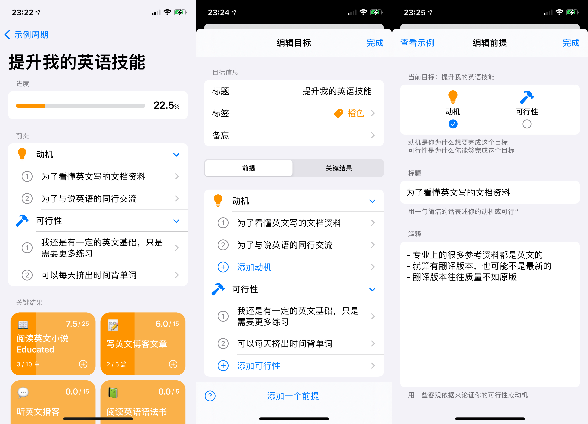

[本文在少数派的链接]: https://sspai.com/post/67874
[一篇文章]: https://sspai.com/post/67497
[app store 下载链接]: https://apps.apple.com/app/id1572457968

[本文在少数派的链接]

前几周，在 Vision 2.0 刚上线时，我怀着试一试的态度在少数派写了[一篇文章]，并神奇般地被选为了精选，更是出乎意料地收到了不少小伙伴们的评论，这一切都让我收获了十足的信心，于是下决心花更多的精力去做好 Vision. 在此感谢少数派以及这里的小伙伴们的支持。

很多小伙伴都提到了想要我将 Vision 适配到 Mac，Web 甚至是安卓。确实也发现不少独立开发者都在产品刚上线初期就急忙去适配全平台，包括我最开始也是这么打算的。但后来仔细一想，我想做的 Vision 是真真切切能帮助到用户，实现它的价值，而不是骗一波订阅就销声匿迹。然而目前 Vision 缺失很多我想要做的功能，如果现在放慢产品功能的更新，而去做全平台适配，我认为并不是一个明智的选择。甚至这也是我并没有急着上 iCloud 同步、付费功能的原因，当然这两者计划会在 8 月中旬左右上线。

## 目标的前提（Premises）

这次 V2.1 上线的新功能也是我心心念念很久的功能 —— 目标的前提（Premises）。

大家或许经常给自己制定目标，但是，你有没有仔细想过“为什么”呢？

譬如，你给自己定了下一个周期的一个目标是：减重 20 斤。但它仅仅是一个你在月初制定下一个周期的过程中想到的一个目标，你可能感觉到了自己的体重越来越变得不健康，同时感觉到体重变重了就需要减重。然而这些“感觉”在缺乏**事实支撑**的情况下，往往很难在周期执行过程中给予你**足够的动力**去完成你设置的关键结果。你很可能在周期执行的过程中也很难拒绝来自不健康美食的诱惑，从而宣告完成目标失败。

再譬如，你有足够的动力想要在下一个周期中实现一个小目标：赚他一个亿。人人都想要获得巨额财富，这是你的动机；但你仅仅是一个普通的打工人。此时发现，有了足够的动机也很难完成目标，还必须要有足够的可行性。

因此，我们认为，人们要完成目标需要两种前提，**动机**和**可行性**。

此时，你要减重 20 斤的动机是：

1. 为了穿衣服好看
2. 为了增强自信心
3. 为了健康，降低患病的概率

同时该目标的可行性有：

1. 时间上，每天下班以后有充足的时间去健身房锻炼
2. 自己能接受多吃沙拉，少吃脂肪含量高的食品
3. 有朋友一起减重，可互相监督

你需要**尽可能多地**列出要完成目标的前提。它们不仅仅是在你制定目标时，给你一个思考该目标的重要性的必要环节，更是在你周期进行中，给你**提供动力**的源泉。实现目标的过程虽苦，但一想到你最初写下的动机，以及你认为的你可以做到的可行性，相信再困难的目标你也可以实现。

除此之外，对于每一条前提，我们希望你也能尽可能多地写一些**客观事实**，去支撑你的动机和可行性。以上文中的动机“为了健康，降低患病的概率”为例，你可能需要收集一些针对“肥胖会导致患病的”客观事实的资料证明，记录在这一栏中。因为人们写下的动机和可行性很可能也是主观猜测的，如果你能列出客观事实去支撑你的猜测，我们相信它会进一步增强你对动机和可行性的认可。

## 新功能的界面

左图为本次新增的“目标详情页”，可点击周期详情页的目标标题进入；左二为目标编辑页新增的前提列表（请注意左下角的问号按钮，是这次新增的帮助页面入口）；右图为新增的前提编辑页

上图为我们本次更新新增的界面。一如既往熟悉纯正的 iOS 风格。

虽然此次更新的“前提”功能是选填，但我们**强烈建议**用户在制定目标时，一定要去使用该功能。我们会在下个月上线的“复盘”功能中用到用户在这里填写的信息。

此次将周期列表放到了一个二级入口中，而 Vision app 的首页只显示当前进行中的周期。未来我们计划要着重打造首页的功能，将用户想要获得的信息“聚合”展示到首页。

## 下一个迭代

下一个迭代 Vision 2.2 我们预计在 8 月中旬上线，计划会有以下主要功能：

-周期结束的复盘功能

- iCloud 同步
- 新的桌面小组件
- 付费功能

之所以选择在 2.2 上线付费功能，是因为我们认为，我们会在下一个迭代基本完成跟 OKR 相关的所有功能环节，是时候检验 Vision 到底能否给用户带来价值的时候了，也需要判断我们是否能够一直持续做下去。

## 最后

Vision 是我一直想要打造的一款可以用偏“硬核”来形容的目标管理工具。就像苹果的硬件产品和 iOS 本身一样，力求做到“少就是更多”，简洁不浮夸，用实打实的功能来作为我们的卖点，也更希望用户是因为我们的产品给他们带来了实际的价值，而选择付费——但愿我们已经走在这条路上了。

关于小伙伴们提到最多的关于多端适配的问题，我在上文已经说明过了。我们相信在未来，如果 Vision 受到了足够多的朋友的喜欢，我们肯定会第一时间适配多端。

欢迎大家发邮件或加微信联系我：

- 邮箱 grepug@icloud.com
- 微信 grepug (加该微信为好友，可以加入我们的用户群)

[App Store 下载链接]
